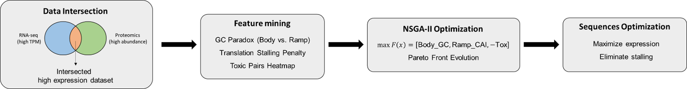
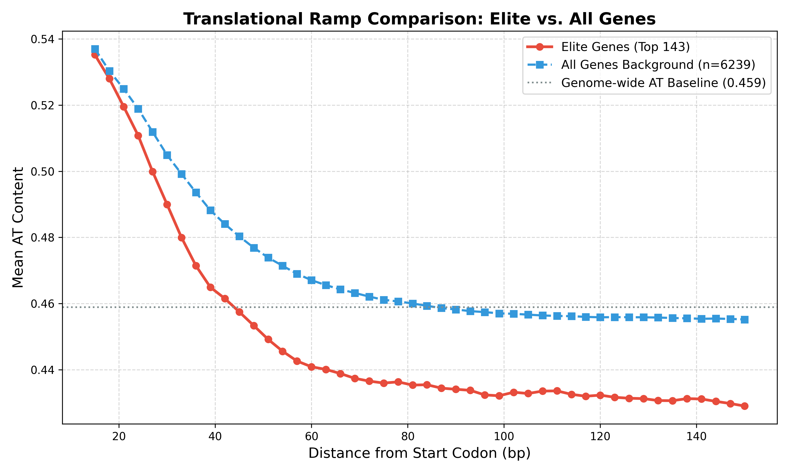
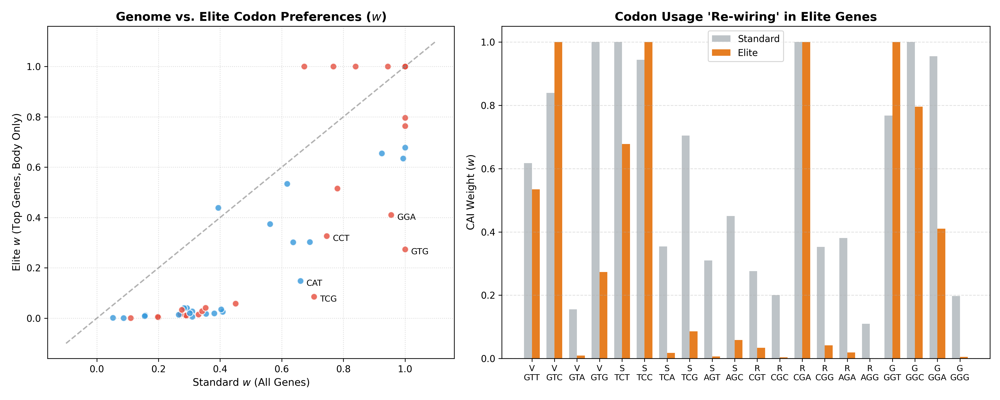
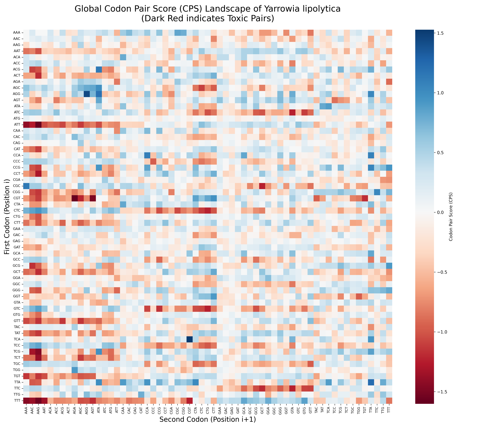
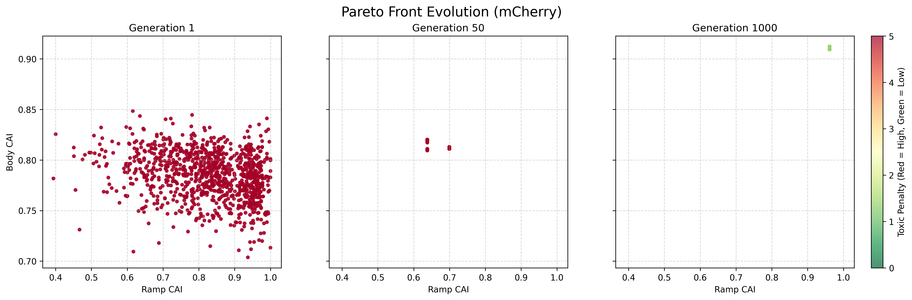
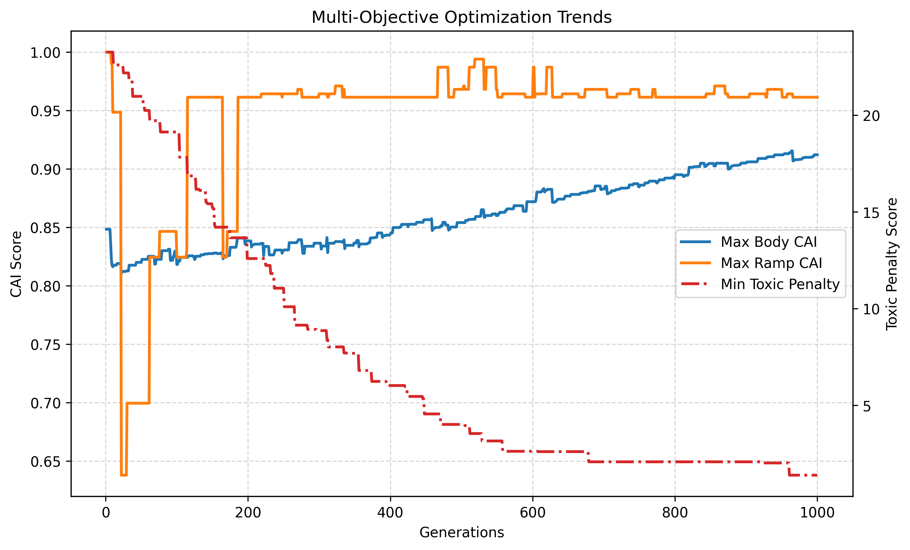

# YaliOpt: Multi-Objective Codon Optimizer for *Yarrowia lipolytica* 🧬💻

> An advanced sequence design pipeline driven by Multi-omics Data and Non-dominated Sorting Genetic Algorithm II (NSGA-II).


## 💡 Overview

**YaliOpt** is an industrial-grade bioinformatics pipeline designed to resolve the bottleneck of heterologous protein expression in *Yarrowia lipolytica*. 

Instead of traditional single-objective CAI (Codon Adaptation Index) maximization, this project utilizes a **Dual-track Strategy** (Ramp vs. Body) and a **Multi-objective Pareto Genetic Algorithm** to balance Translation Initialization Speed, Global Translation Efficiency, and Translational Toxicity Avoidance.

*(Graphical Abstract)*


---

## 🧬 Data-Driven Mechanics & Validation

The algorithm's rules are not arbitrarily assigned; they are strictly mined from cross-omics data (Transcriptomics & Proteomics) of *Yarrowia lipolytica*.

### 1. The 5' Translation Ramp Hypothesis
By analyzing the absolute elite highly-expressed genes, we validated a structural requirement for a "loose" 5' initialization region. Elite genes exhibit significantly higher AT content (lower GC) in the first 39bp and lower AT content (higher GC) compared to the global genome average.


### 2. Codon Preference Rewiring (Body Region)
High expression does not simply mean maximizing GC content. The pipeline identifies how elite genes fundamentally rewire their codon preferences (blue vs. red distributions) for specific amino acids to achieve maximal elongation speed.


### 3. Genome-Wide Toxicity Avoidance (CPS)
Not all codon combinations are safe. We scanned the entire genome to calculate the Codon Pair Score (CPS). The dark red regions in the heatmap indicate translationally "toxic" pairs that cause ribosomal stalling, which our algorithm strictly avoids.


---

## 🚀 Core Engine in Action: mCherry Case Study

To demonstrate the power of the flat-architecture NSGA-II engine, we optimized the sequence for the 236-AA fluorescent protein, **mCherry**.

### The Pareto Evolution
Watch the algorithm push the sequence population toward the theoretical limits. It successfully generates a diverse Pareto front, offering distinct sequence designs (Design A: Max Elongation, Design B: Max Ramp, Design C: Balanced).


### Multi-Objective Convergence Trends
The engine reliably converges within 150 generations, maintaining high diversity while pushing the toxic penalty down to absolute zero.


---

## 💻 Quick Start (Demo)

Want to see the Pareto algorithm in action? We have pre-calculated the biological rules (`pareto_codon_blueprint.csv` and `yali_toxic_pairs.csv`) for you!

```bash
# 1. Clone the repository
git clone [https://github.com/zhanghaoming9488-cpu/Yarrowia-Pareto-Optimizer](https://github.com/zhanghaoming9488-cpu/Yarrowia-Pareto-Optimizer)
cd YaliOpt

# 2. Run the Core Pareto Optimization Engine
python 03_Core_Algorithm/09_NSGA2_pareto_optimizer.py

Note: This will output the three optimal DNA sequences directly to your console.

## 📂 Project Structure
This project is highly modularized, taking you from raw FASTQ reads to final algorithm visualization.

Part 1: Data Preparation
01_fetch_raw_reads.py: Downloads raw RNA-seq data from NCBI SRA.

02_download_reference.py: Fetches the Y. lipolytica reference genome.

03_run_kallisto_quant.py: Quantifies gene expression using Kallisto.

Part 2: Knowledge Mining (Rule Extraction)
04_find_rna_inflection.py: Identifies high-expression baseline via mathematical inflection points.

05_intersect_multi_omics.py: Cross-references transcriptomic and proteomic data.

06_detect_5prime_ramp.py: Validates the AT-rich 5' translation ramp region.

07_generate_dual_blueprint.py: Extracts independent codon weight matrices.

08_mine_toxic_pairs.py: Scans the whole genome to build the toxicity blacklist.

Part 3: Core Algorithm
09_nsga2_pareto_optimizer.py: Executes the 3D multi-objective genetic evolution.

Part 4: Scientific Visualization
10_plot_ramp_comparison.py

11_plot_cai_rewiring.py

12_plot_pareto_evolution.py

✉️ Contact & Feedback
If you have any questions about the algorithm design, industrial biomanufacturing applications, or just want to connect, feel free to reach out!
